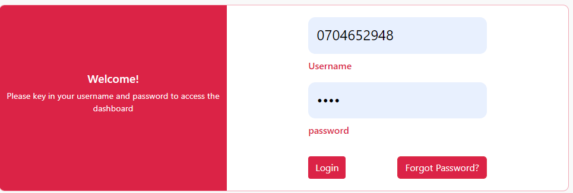
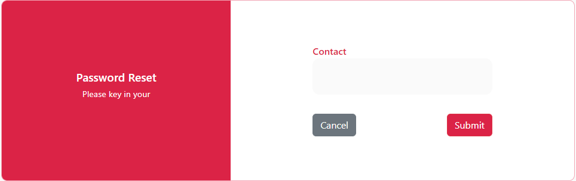
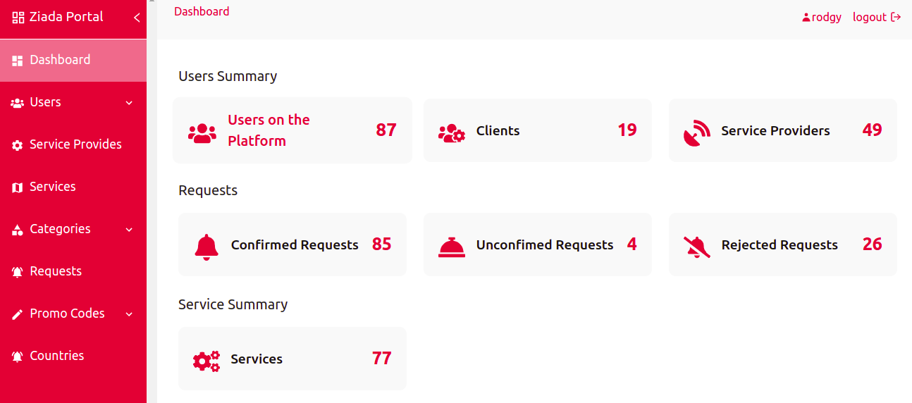

<h3>Login </h3>

 1. The first time when launching the ziada portal you have to login with the correct username and password so that you can be able to access the information in the portal

 2. And if you don't remember the password you have to reset your password so that you can be able to proceed with logging in  

 3. After a successful login you will be directed to the dashboard which shows the users summary, request made by clients and their statuses, services summary that are available and the logout button

