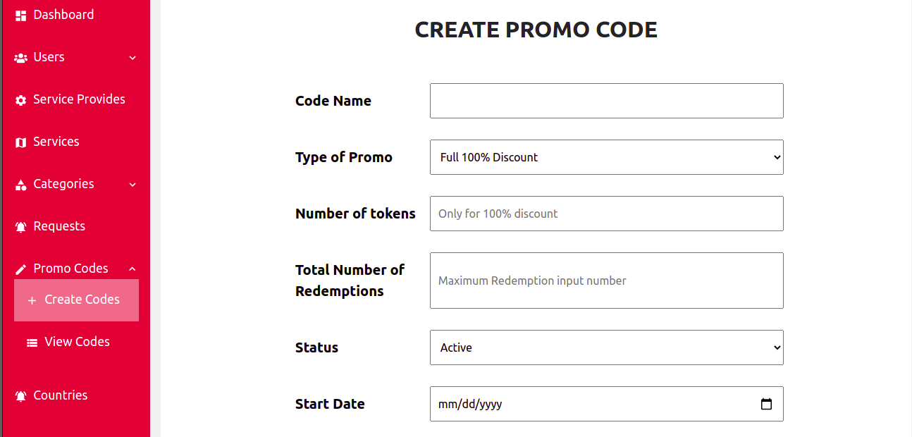
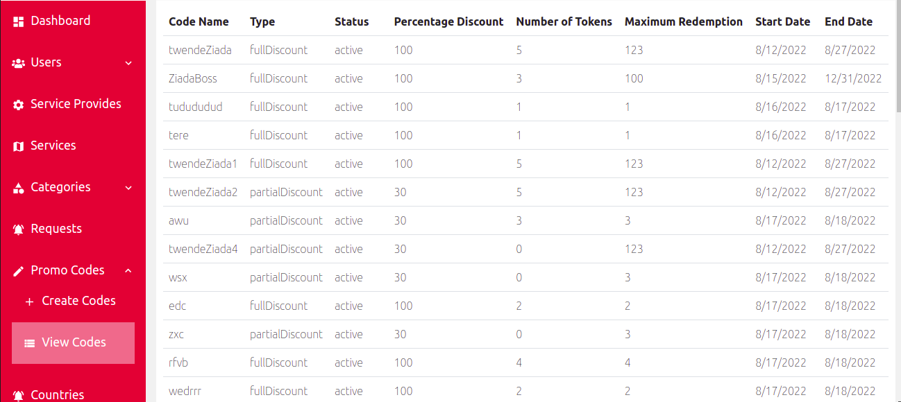
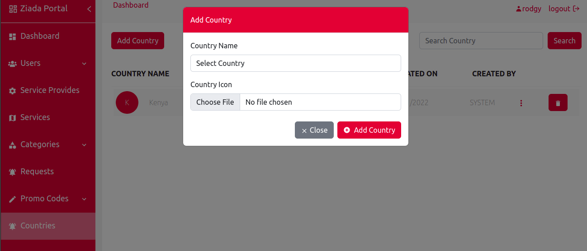

<h3> Promo Codes </h3>

<h4> Under promo codes we have a page  for creating the promo codes and a page for viewing the promo codes 
</h4>

<h3>Create promo code</h3>

 1. On create promo code page  you will be able to create a promo code by entering the code name, types of the promo code, number of tokens, total number of reedemption,status, start date and the end date 

<h3>View codes</h3>

 2. On the view codes pages, it shows all the created promo codes that are available in the portal

<h3>Countries </h3>

 3. On the countries page it shows all the available countries, a button for adding a new country, a seach button for searching the available countries, a button for deleting and an option for editing the country detail

