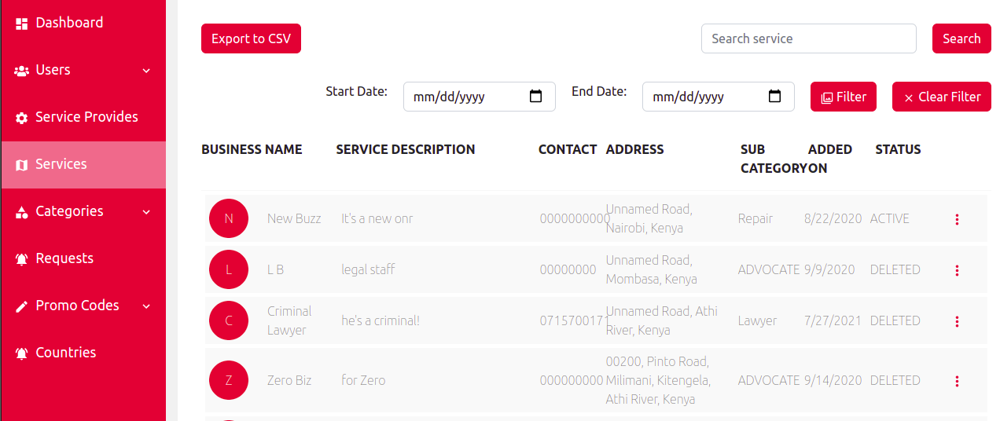
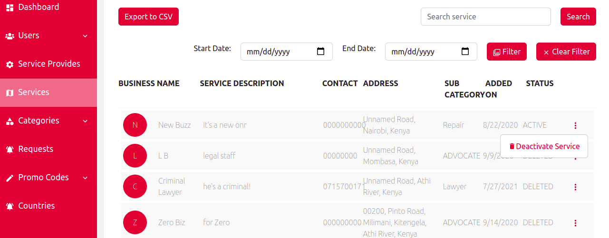
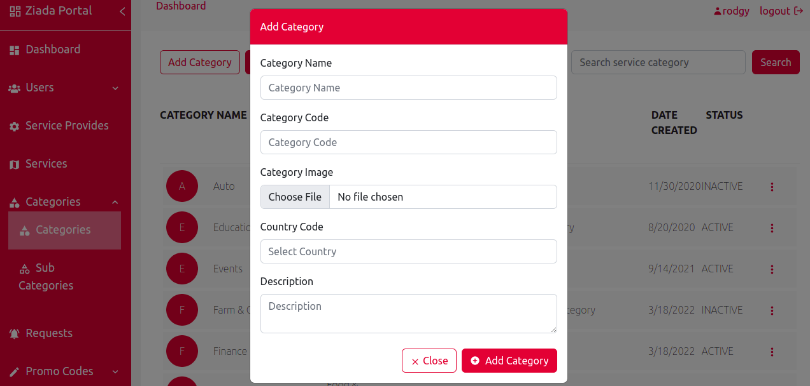
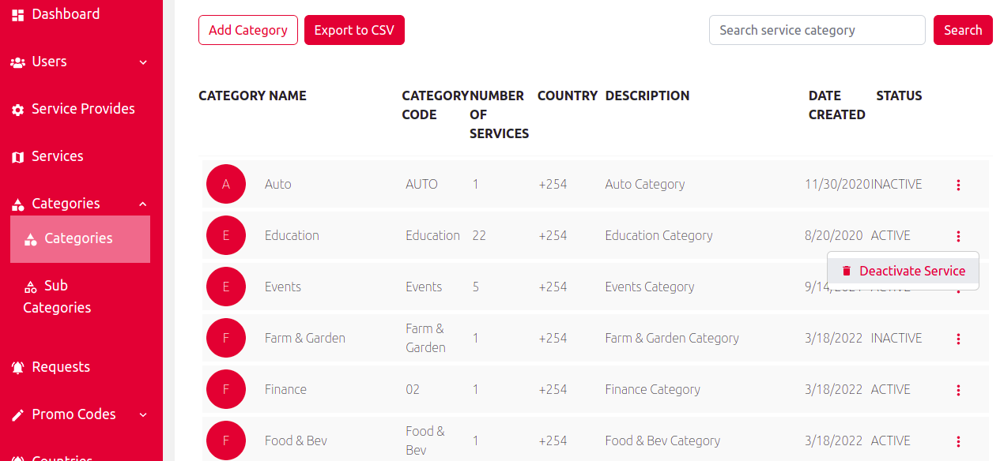
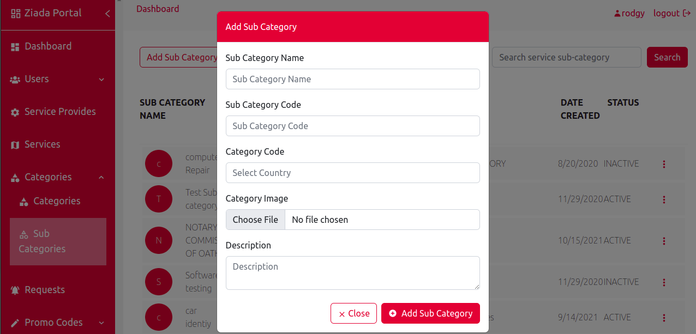
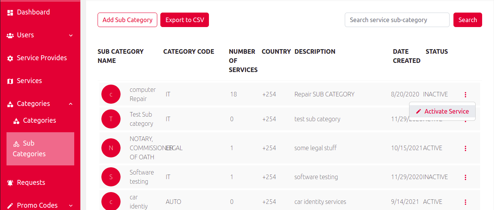
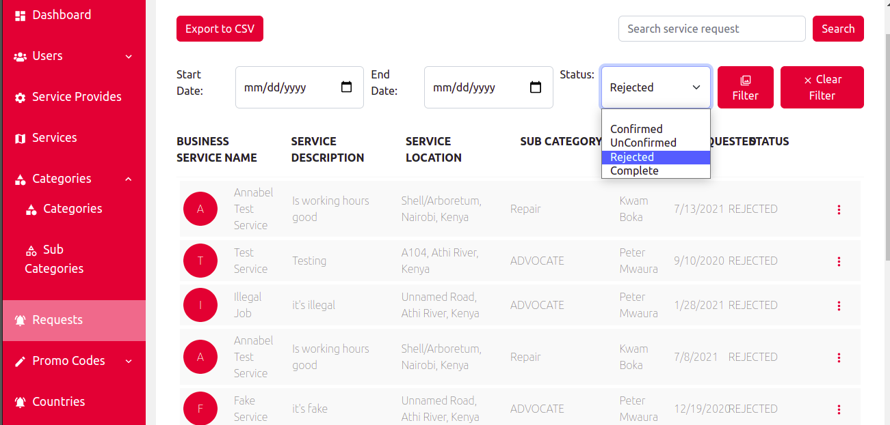
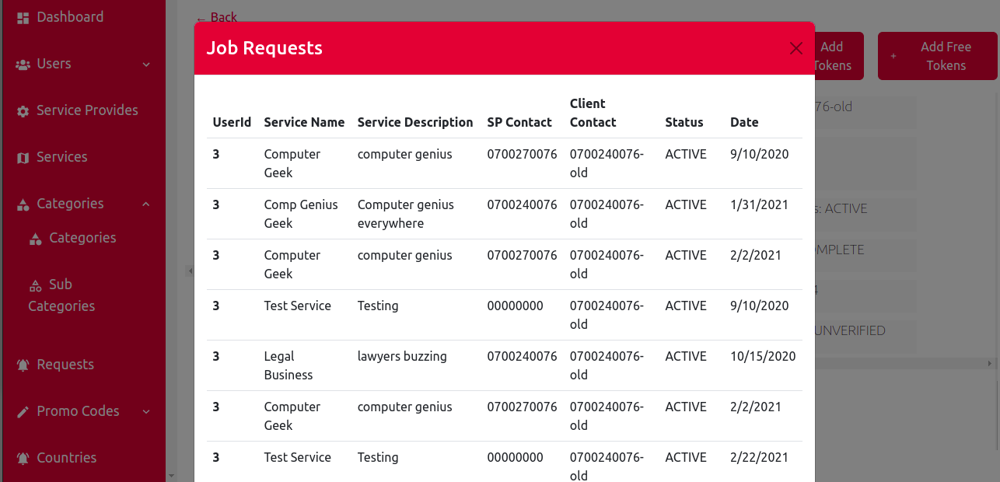

<h3>Services</h3>

 1, (i). On the services page it shows all the services that are available in ziada app and their statuses, filters for filtering the services with their registration date, search button for serching the services available, a button for exporting the services into a csv file and a button for clearing the filters 

 (ii). It also gives an option for deactivating a service 

<h3>Categories</h3>

<h4>Under the categories we have the service categories and the service sub categories</h4>

 2, (i). On the categories page it shows all the service actegories that are availble in the app with their statuses, a button for adding a new service category, search button, a button for exporting the service categories into the csv file and a button for clearing the filters

 (ii). It also gives an option for deactivating and activating the service categories

 3, (i).On the sub categories page show the list of service sub categories that are available in the app with their statuses, a button for adding a new service sub category, search button, a button for exporting the service sub categories into the csv file and a button for clearing the filters

 (ii). It also gives the otion for activating and deactivating the service sub categories 

<h3>Request</h3>

 4, (i) On the requests page it shows all the request made by the clients and their statuses, request type, filters for filtering the request with their statuses, a search button, a button for exporting the client requests into a csv file and a button for clearing the filters

 (ii). It also gives an option for viewing the individual  job requests made by the clients to a specific service provider 

