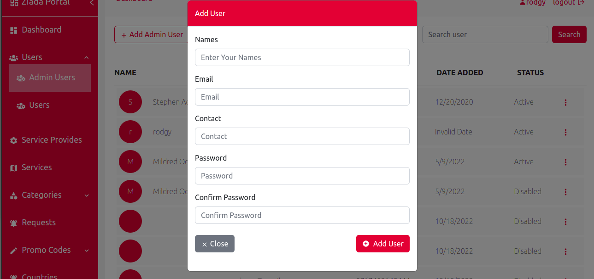
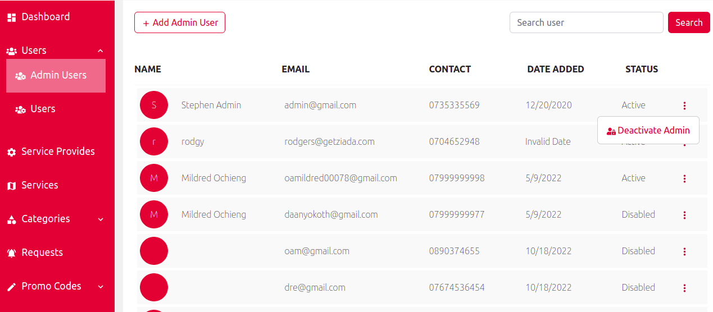
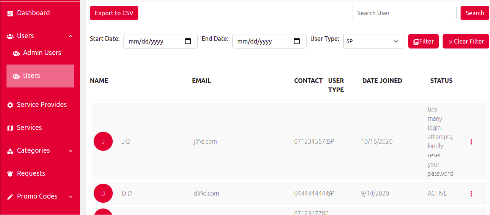
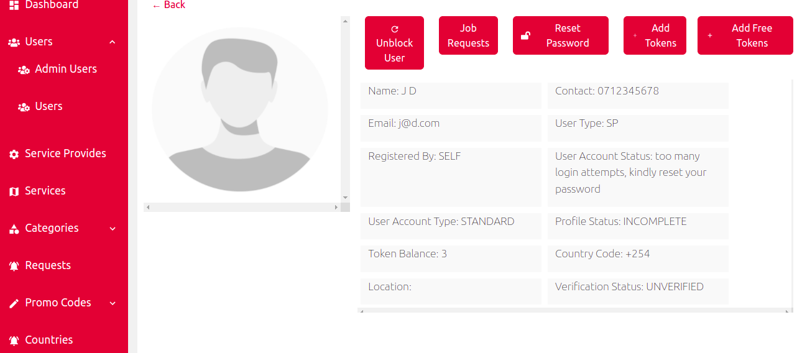
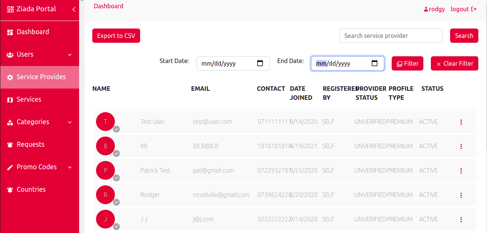
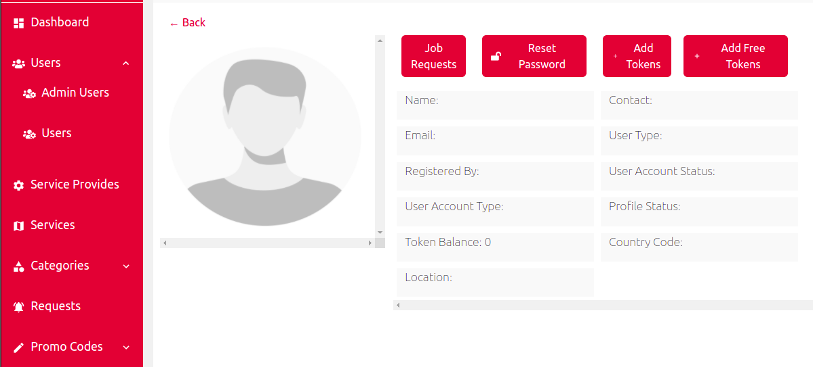

<h3>Users</h3>

<h4>Under users we have admin users, clients and service providers </h4>

 1, (i). On the admin users side shows the number of admin registered into the portal,a button for adding an admin user and the search button for serching the admin users

(ii). It also gives an options of deactivating the admin user

 2, (i). On the users side it shows the clients and service providers registered into ziada application, filters for filtering the clients and the service providers, a search button, the button for exporting users information into a csv file and a button for clering the filters

 (ii). It also gives a option for viewing individual datails

<h3>Service provider</h3>

 3, (i). On the service providers page it shows all the service providers that are registered into ziada app, filters for filtering the service providers according to date they registered, the statuses of their services, search button, a button for exporting their information into a csv file and the button for clearing the filters 

 (ii). It also gives a option for viewing individual datails

